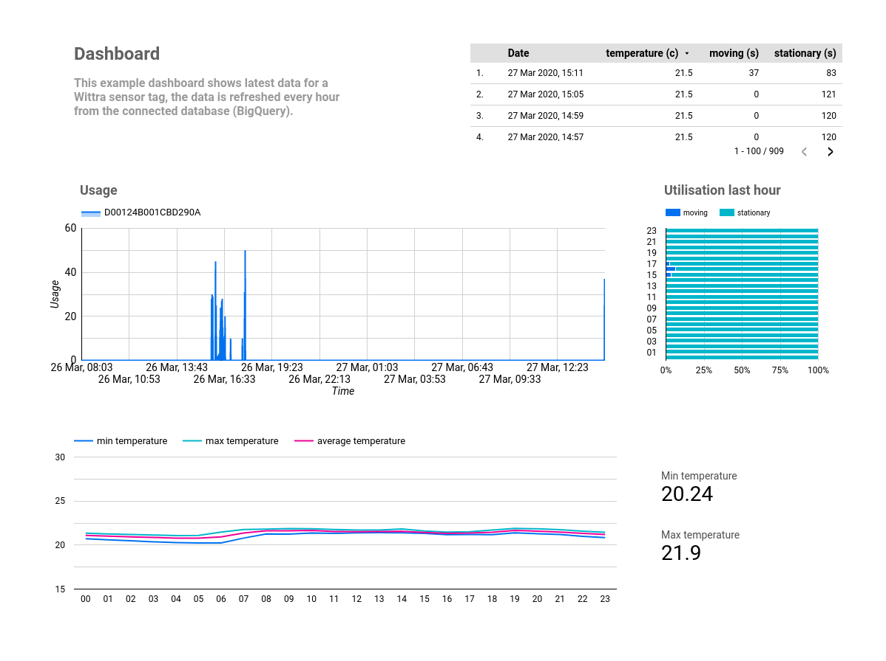
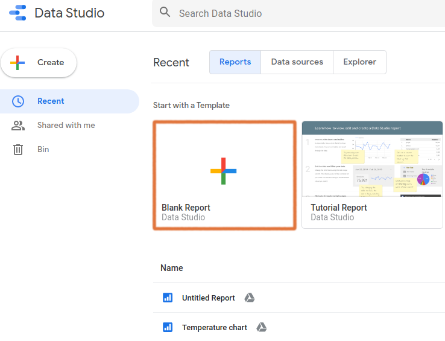
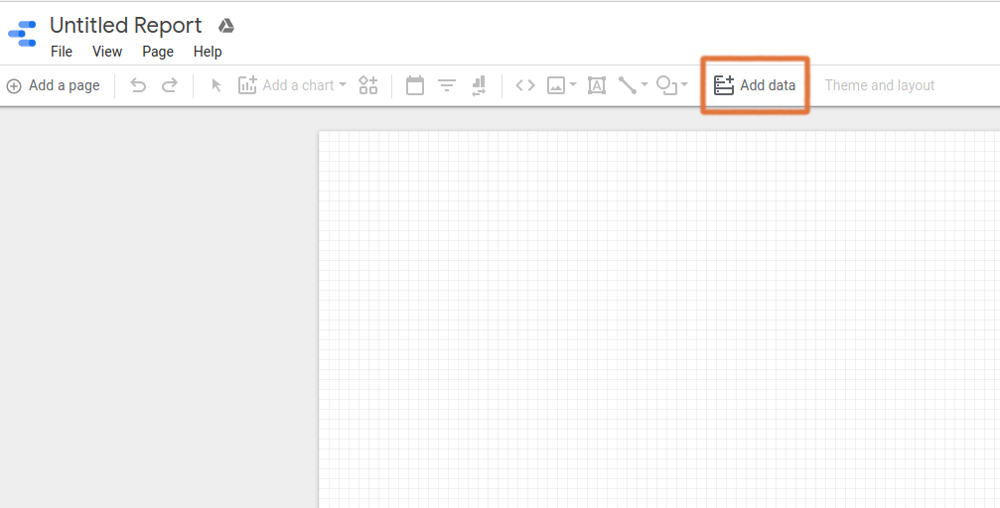
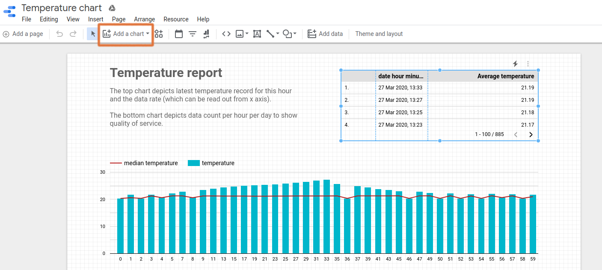
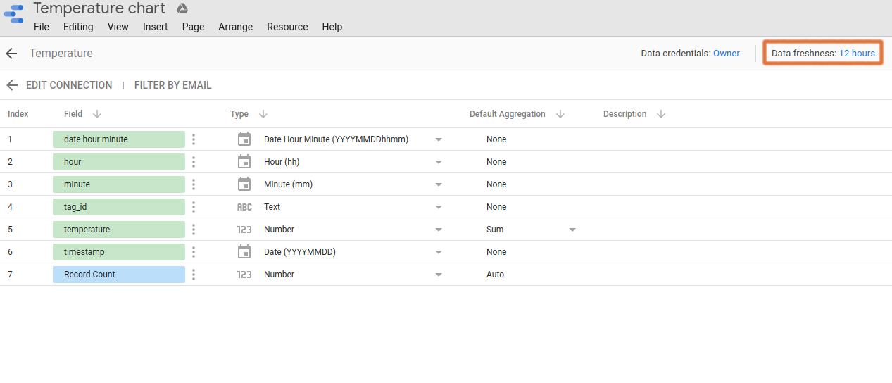

## Create reports and dashboards with Data Studio



This is a short tutorial on how to set up a dashboard (or report as stated by
data studio) in Google Data Studio (this can easily be done in other tools such
as [Tableu](https://www.tableau.com/)).

The aim is to show the potential of what you can do with the data from our
Wittra sensor network.

### Prerequisites

In order to produce the dashboard it assumes you have already set up a
database, to store the streamed data from the network. In this example we use
[BigQuery](https://cloud.google.com/bigquery/what-is-bigquery), an enterprise
data warehouse by Google. For inspiration on how to setup a database from
streamed data please see
[this example](https://cloud.google.com/dataflow/docs/guides/templates/provided-streaming#running-the-pubsub-topic-to-bigquery-template).

A Google account, to log into Data Studio. Note that Data Studio is free, but
the queries to the database may cost money depending on the database and the
amount of data.

### 1. Create a new dashboard

Start by logging into
[Data Studio](https://datastudio.google.com/navigation/reporting) and click the
Blank Report button.



### 2. Add a data source

To populate the dashboard you will need to add a *connector* (in this case your
BigQuery). When creating a new report the `add data view` will be opened
automatically, if not click `add data` to the right in the top panel.



There are several different type of connectors already existing in Data Studio,
some are directly connected to the Google infrastructure and some are external
connectors such as *MySQL*, *PostgreSQL* and *File Upload*. You
can also [add your own connectors](https://developers.google.com/datastudio/connector/build)
to interface with Data Studio.

In this example we will create a dashboard for a specific tag showing
temperature and usage. We will choose **BigQuery** as data source and retrieve
the data with a **custom query**.

```
SELECT
  *
FROM
  `<project-id.dataset.table>`
WHERE tag_id like '<tag-id>'
ORDER BY timestamp desc
```

Where `<project-id.dataset.table>` is replaced with the database table you want
to extract, in our case we have the table temperature and usage. Replace 
`<tag-id>` with one of the device IDs in your project.


We first add temperature and then usage which we have stored in two different
tables under a data set in BigQuery.

Note all data sources you add are named by default (in this case the default
name is BigQuery). To distinguish several different data sources it is good
practice to rename them to a more descriptive name.

### 4. Add a chart

In the top panel navigate to `Add a chart`and select the chart of your choice.



For more details on how to create charts and visualize data see
[data studio support](https://support.google.com/datastudio#topic=6267740).

### 5. Switch data source

The default data source is the latest you added to the report, if you want to
create a chart with another data source you need to switch it by;

1. First removing the data source.
2. Then adding the source you want in a drop-down list.


### 3. Blend data

In order to use the two data sources temperature and usage in the same chart
you need to **blend data**. First add a chart, navigate to the chart panel on
the right hand side in the window and press `blend data`. Join the two tables
temperature and usage as shown in the gif below.


### 4. Break down data

The default timestamp is in the format `YYYYMMDD`, meaning if you want to view
data in more detail than per day you need to **add this data field** to your
data source.


### 5. Refreshing data

The data shown on the dashboard is pulled from a database, the default
frequency on how often the data is pulled is 12 hours. You can change this to
either every hour or every 4th hour, in BigQuery how often you pull is creating
cost, by opening **Resource>Manage** added data sources>edit. In the top panel
click the `Data freshness` button and change it to the preferred data frequency.


